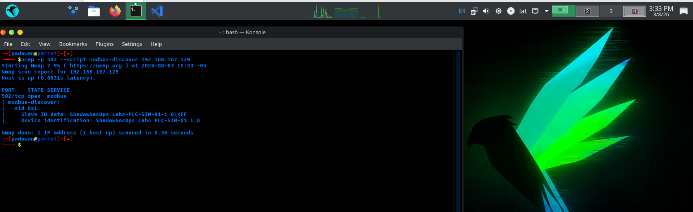
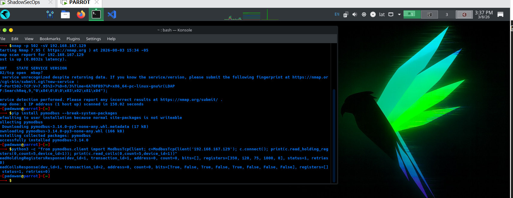
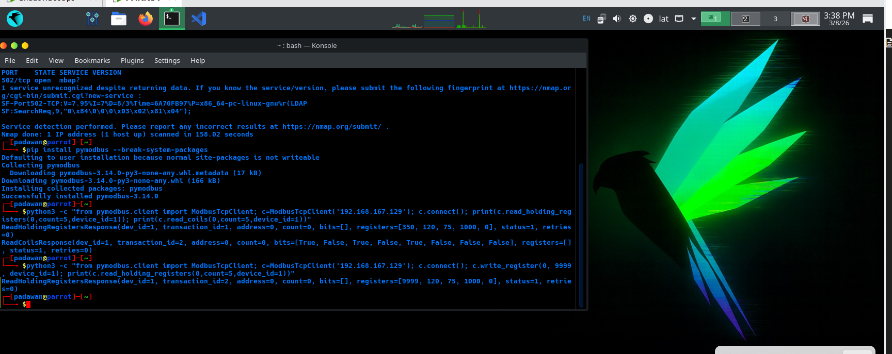
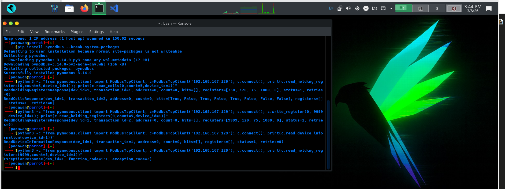
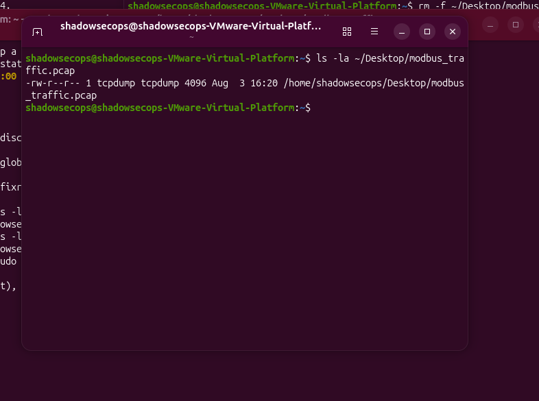
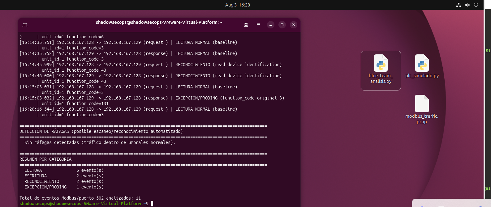
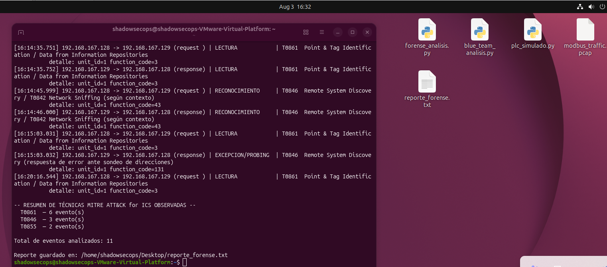
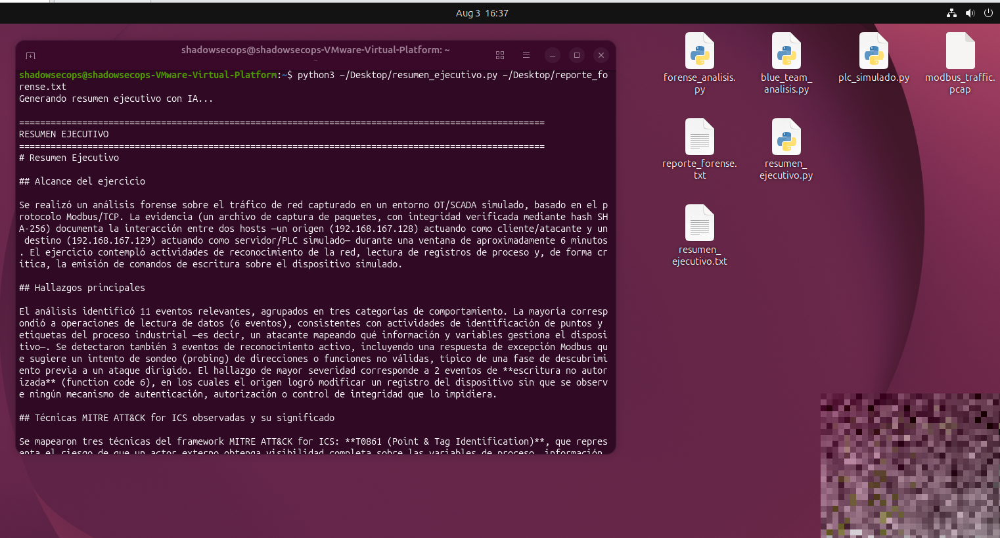

# Reconocimiento, Análisis de Seguridad y Forense en un Entorno OT Simulado (Modbus/SCADA)

Laboratorio personal de ciberseguridad OT/ICS que combina **Red Team**, **Blue Team** y **Análisis Forense** sobre un entorno Modbus/SCADA simulado, con integración de IA (API de Anthropic) para la generación del resumen ejecutivo. Este README documenta cada comando ejecutado y su propósito, para que el laboratorio pueda replicarse paso a paso.

📄 Informe técnico completo (con capturas, comandos explicados y scripts en anexo): [`informe_final.docx`](informe_final.docx)

## Entorno

- **VM Parrot Security OS** (`192.168.167.128`) — estación de ataque/reconocimiento, adaptador de red en modo NAT (VMware Workstation).
- **VM Ubuntu 26.04 "ShadowSecOps"** (`192.168.167.129`, 4 GB RAM) — aloja el PLC simulado, adaptador de red en modo NAT.
- PLC simulado: servidor Modbus TCP construido con **pymodbus 3.14**, puerto 502.

> **Nota metodológica:** el proyecto originalmente contempló usar Conpot como honeypot ICS, pero se descartó por incompatibilidad con Python moderno (dependencias abandonadas). Se optó por construir un servidor Modbus TCP propio con pymodbus.

---

## Fase 0 — Preparación del entorno y verificación de conectividad

### Verificar la IP de cada VM
Ejecutado en **ambas VMs**:
```bash
ip a
```
Confirma la IP asignada a cada interfaz de red dentro del rango NAT de VMware (Ubuntu: `ens33` → `192.168.167.129/24`; Parrot → `192.168.167.128`).

### Confirmar el modo de red en VMware Workstation
En el menú de VMware Workstation (no dentro de la VM): clic derecho sobre cada VM → **Settings → Network Adapter**, y verificar que ambas estén en el **mismo modo** (NAT). Si una está en NAT y la otra en Host-only, no se ven entre sí aunque tengan IPs del mismo rango aparente.

### Probar la conectividad entre las VMs
Desde **Parrot**:
```bash
ping -c 4 192.168.167.129
```
Una respuesta con paquetes recibidos (0% packet loss) confirma que ambas VMs se ven en la red antes de continuar.

### Crear el entorno virtual e instalar pymodbus (en Ubuntu)
```bash
python3.11 -m venv ~/ot-lab-env
source ~/ot-lab-env/bin/activate
pip install --upgrade pip
pip install pymodbus
python3 -c "import pymodbus; print(pymodbus.__version__)"
```
Aísla las dependencias del laboratorio del resto del sistema. Versión usada: **pymodbus 3.14.0**.

---

## Fase 1 — Red Team

### Levantar el PLC simulado (en Ubuntu)
```bash
sudo ~/ot-lab-env/bin/python3 ~/Desktop/plc_simulado.py
```
Requiere `sudo` porque el puerto 502 está por debajo de 1024. Se usa la ruta completa al intérprete del venv porque `sudo` no hereda el entorno virtual activado.

> **Notas de compatibilidad con pymodbus 3.14** (ver script completo en [`plc_simulado.py`](plc_simulado.py)): el parámetro `slave=` del cliente fue renombrado a `device_id=`; `ModbusSlaveContext` fue renombrado a `ModbusDeviceContext` (y `ModbusServerContext` ahora usa `devices=` en vez de `slaves=`); `ModbusDeviceIdentification` se importa desde el paquete raíz `pymodbus`, no desde `pymodbus.device`.

### Reconocimiento pasivo con Nmap (desde Parrot)
```bash
nmap -p 502 --script modbus-discover 192.168.167.129
nmap -p 502 -sV 192.168.167.129
```
El script NSE `modbus-discover` extrae metadata del dispositivo (Slave ID, identificación) sin interactuar manualmente con el protocolo — equivalente a **MITRE ATT&CK for ICS T0846** (Remote System Discovery).



### Instalar pymodbus en Parrot (como cliente)
```bash
pip install pymodbus --break-system-packages
```

### Lectura de holding registers y coils
```bash
python3 -c "from pymodbus.client import ModbusTcpClient; c=ModbusTcpClient('192.168.167.129'); c.connect(); print(c.read_holding_registers(0,count=5,device_id=1)); print(c.read_coils(0,count=5,device_id=1))"
```
Lectura legítima de las variables del proceso simulado — **T0861** (Point & Tag Identification).



### Escritura no autorizada
```bash
python3 -c "from pymodbus.client import ModbusTcpClient; c=ModbusTcpClient('192.168.167.129'); c.connect(); c.write_register(0, 9999, device_id=1); print(c.read_holding_registers(0,count=5,device_id=1))"
```
Simula la manipulación de un setpoint sin autenticación — **T0855** (Unauthorized Command Message), el hallazgo de mayor severidad del ejercicio.



### Identificación de dispositivo y excepción deliberada
```bash
python3 -c "from pymodbus.client import ModbusTcpClient; c=ModbusTcpClient('192.168.167.129'); c.connect(); print(c.read_device_information(device_id=1))"

python3 -c "from pymodbus.client import ModbusTcpClient; c=ModbusTcpClient('192.168.167.129'); c.connect(); print(c.read_holding_registers(9999,count=5,device_id=1))"
```
El primer comando intenta leer metadata extendida (function code 0x2B) — el servidor simulado devuelve una respuesta vacía. El segundo fuerza una dirección fuera de rango, generando una `ExceptionResponse` (function_code=131, exception_code=2 — Illegal Data Address), tráfico característico de sondeo/probing.



---

## Fase 2 — Blue Team

### Captura de tráfico (en Ubuntu)
```bash
sudo tcpdump -i ens33 -w ~/Desktop/modbus_traffic.pcap port 502
```
Se deja corriendo mientras se repiten (desde Parrot) las cuatro pruebas de Red Team, para capturar las cuatro firmas con timestamps reales. **Importante:** confirmar que aparezca `tcpdump: listening on ens33...` antes de generar tráfico — si tcpdump queda esperando la contraseña de `sudo` sin que se note, el pcap se crea pero queda vacío.

Al terminar: `Ctrl+C` para cerrar la captura limpiamente, y verificar:
```bash
ls -la ~/Desktop/modbus_traffic.pcap
```



### Análisis y clasificación del tráfico
```bash
pip install scapy --break-system-packages
python3 ~/Desktop/blue_team_analisis.py ~/Desktop/modbus_traffic.pcap
```
El script ([`blue_team_analisis.py`](blue_team_analisis.py)) reconstruye cada transacción Modbus y la clasifica en lectura / escritura / reconocimiento / excepción, además de detectar ráfagas de requests. *(No se usa `sudo` aquí: scapy quedó instalado en el directorio de usuario, y el pcap es legible sin privilegios elevados).*



**Resultado:** 6 lecturas normales, 2 escrituras, 2 eventos de reconocimiento, 1 excepción/probing — 11 eventos totales, sin ráfagas anómalas.

---

## Fase 3 — Forense

### Generar el reporte forense (timeline + hashing + MITRE)
```bash
python3 ~/Desktop/forense_analisis.py ~/Desktop/modbus_traffic.pcap
```
El script ([`forense_analisis.py`](forense_analisis.py)) calcula el hash SHA-256 del pcap (cadena de custodia), reconstruye el timeline unificado, y mapea cada evento a MITRE ATT&CK for ICS. Guarda todo en `reporte_forense.txt`.



| Técnica MITRE ATT&CK for ICS | Descripción | Eventos observados |
|---|---|---|
| T0861 | Point & Tag Identification | 6 |
| T0846 | Remote System Discovery | 3 |
| T0855 | Unauthorized Command Message | 2 |

### Generar el resumen ejecutivo con IA
```bash
pip install anthropic --break-system-packages
export ANTHROPIC_API_KEY="aqui poner el api key"
python3 ~/Desktop/resumen_ejecutivo.py ~/Desktop/reporte_forense.txt
```
El script ([`resumen_ejecutivo.py`](resumen_ejecutivo.py)) envía el reporte forense a la API de Claude con un prompt de sistema orientado a redactar un resumen ejecutivo, y guarda el resultado en `resumen_ejecutivo.txt`.

> Reemplaza el texto entre comillas por tu API key real (obtenida en [console.anthropic.com](https://console.anthropic.com)). Nunca escribas la key directamente en el script ni la subas al repositorio.



---

## Resultados completos

- [`reporte_forense.txt`](reporte_forense.txt) — timeline + hash SHA-256 + mapeo MITRE (contenido completo)
- [`resumen_ejecutivo.txt`](resumen_ejecutivo.txt) — resumen ejecutivo generado por IA (contenido completo)

## Estructura del repositorio

```
.
├── README.md
├── informe_final.docx
├── img/
│   ├── 01_pymodbus_instalado.png
│   ├── 02_nmap_modbus_discover.png
│   ├── 03_lectura_modbus_parrot.png
│   ├── 04_escritura_no_autorizada.png
│   ├── 05_deviceinfo_excepcion.png
│   ├── 06_captura_tcpdump.png
│   ├── 07_blue_team_clasificacion.png
│   ├── 08_forense_timeline_mitre.png
│   └── 09_resumen_ejecutivo_ia.png
├── plc_simulado.py
├── blue_team_analisis.py
├── forense_analisis.py
├── resumen_ejecutivo.py
├── modbus_traffic.pcap
├── reporte_forense.txt
└── resumen_ejecutivo.txt
```

## Herramientas utilizadas

- `pymodbus` 3.14 — servidor y cliente Modbus TCP
- `nmap` (script NSE `modbus-discover`) — reconocimiento pasivo
- `tcpdump` / `scapy` — captura y análisis de tráfico
- API de Anthropic (Claude) — generación del resumen ejecutivo
