# Caso Integrador: Reconocimiento con Nmap, Esteganografía y Análisis Forense de Timeline en Parrot OS

**Autor:** Victor Bastidas
**Entorno:** Parrot Security OS (VMware Workstation) — usuario `padawan@parrot`
**Fecha:** 1 de agosto de 2026

---

## 1. Objetivo

Ejecutar un caso de investigación integrador que combina tres disciplinas trabajadas por separado en prácticas anteriores: **reconocimiento de red con Nmap**, **esteganografía** (ocultamiento y detección de información en imágenes) y **análisis forense** mediante construcción de timeline. El escenario simula un host de la propia red que expone un servicio web con un archivo sospechoso, el cual debe ser identificado, descargado, analizado y desentrañado, documentando cada paso con evidencia verificable (hashes, capturas, timeline).

### Escenario

En la red interna (la propia máquina virtual) se detecta un host con un servicio web activo que no debería estar expuesto. Como analista, se debe: reconocer el host con Nmap, extraer el archivo que aloja, analizar sus metadatos, detectar si contiene información oculta mediante esteganografía, verificar su integridad en cada etapa, y documentar la investigación completa en un timeline forense.

## 2. Entorno de laboratorio

| Componente | Detalle |
|---|---|
| Sistema operativo | Parrot Security OS (máquina virtual, VMware Workstation) |
| Usuario | `padawan@parrot` (con `sudo` cuando fue requerido) |
| Herramientas | `nmap`, `steghide`, `stegseek`, `exiftool`, `imagemagick`, `python3`, `sha256sum`, `find` |
| Directorio de trabajo | `~/CASO_INTEGRADOR` |

## 3. Desarrollo paso a paso

### Fase 0 — Preparación del entorno objetivo

Se instalan las herramientas necesarias y se prepara la "escena": un mensaje confidencial que se oculta dentro de una imagen generada localmente, simulando una filtración de datos alojada en un servicio expuesto.

```bash
mkdir -p ~/CASO_INTEGRADOR/servidor && cd ~/CASO_INTEGRADOR
sudo apt update && sudo apt install -y steghide nmap exiftool imagemagick
which steghide nmap exiftool
```

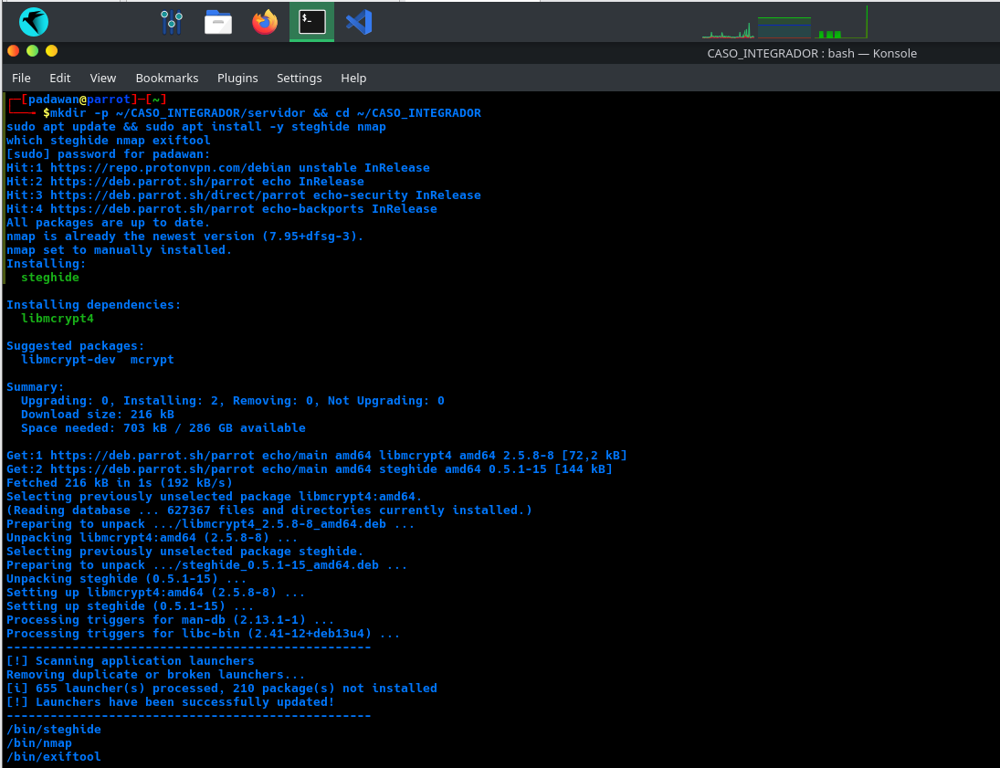
*Figura 1. Instalación de las herramientas base del caso: steghide, nmap y exiftool.*

Se crea el mensaje confidencial y la imagen que servirá de portador, y se oculta el archivo dentro de ella con steghide:

```bash
echo "Coordenadas de la base secreta: 19.4326,-99.1332 - Clave de acceso: R3dTeam2026" > secreto.txt
convert -size 800x600 xc:skyblue -pointsize 40 -draw "text 100,300 'Reporte Interno - Confidencial'" servidor/my_sol.jpg
steghide embed -cf servidor/my_sol.jpg -ef secreto.txt -p "clave123"
file servidor/my_sol.jpg
```

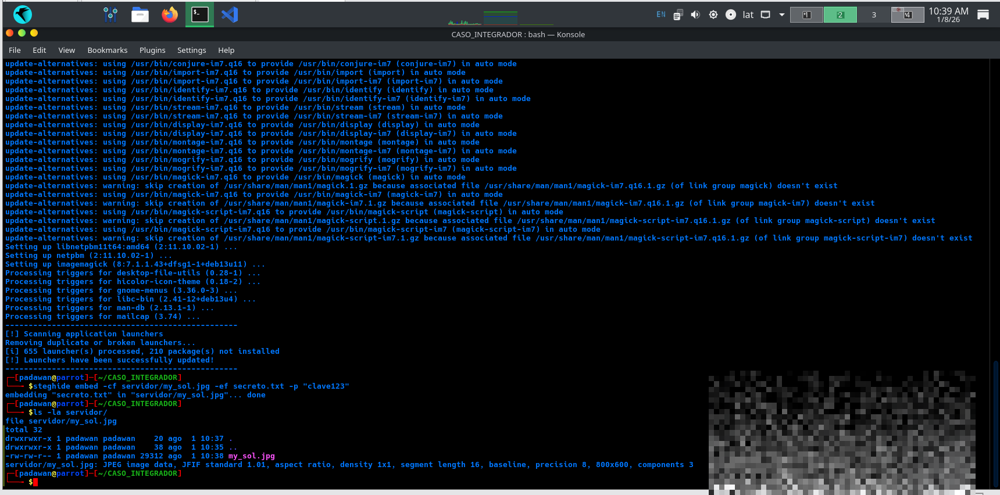
*Figura 2. Ocultamiento exitoso del archivo secreto.txt dentro de la imagen my_sol.jpg mediante steghide; el archivo resultante sigue siendo un JPEG válido.*

Se publica el archivo en un servidor HTTP simple, simulando el host expuesto que será investigado:

```bash
cd ~/CASO_INTEGRADOR/servidor && python3 -m http.server 8888 &
curl -s http://localhost:8888/
```

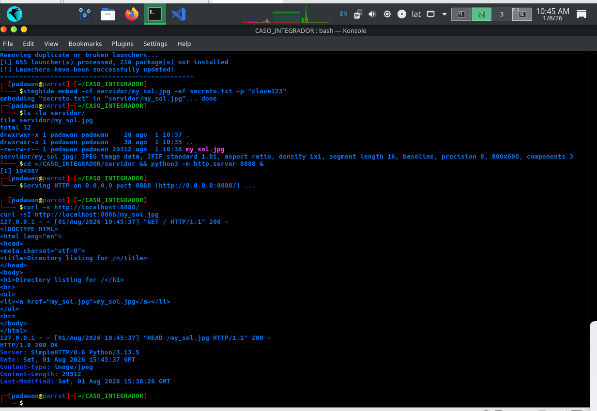
*Figura 3. Servidor activo en el puerto 8888. El listado de directorio queda expuesto públicamente, revelando el nombre del archivo my_sol.jpg sin necesidad de conocerlo previamente.*

### Fase 1 — Reconocimiento con Nmap

A partir de aquí se adopta el rol de analista: se escanea el host como si no se conociera su contenido, únicamente con la información que las herramientas revelan.

```bash
nmap -p 8888 -sV localhost
```

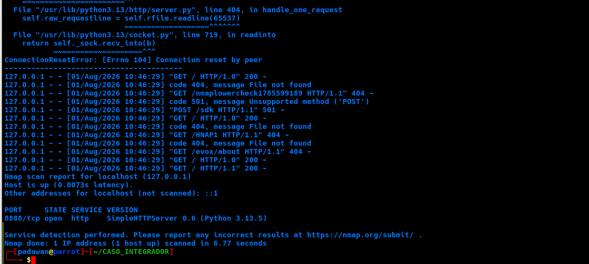
*Figura 4. Detección de versión: Nmap identifica el servicio exacto (SimpleHTTPServer 0.6, Python 3.13.5) expuesto en el puerto 8888.*

Se amplía el escaneo con scripts NSE y se exporta la evidencia a un archivo de texto:

```bash
nmap -p 8888 -sV -sC -oN evidencia_nmap.txt localhost
cat evidencia_nmap.txt
```

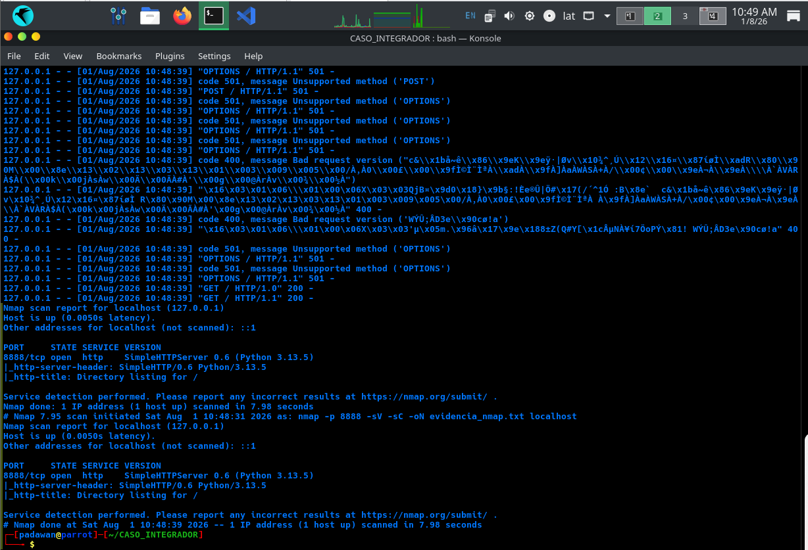
*Figura 5. Resultado final del escaneo con scripts NSE: confirma la cabecera del servidor (http-server-header) y detecta automáticamente el directory listing expuesto (http-title).*

> El escaneo de detección de versión generó tráfico de sondeo (fingerprinting) —peticiones a rutas típicas de dispositivos y servicios conocidos— que provocó una excepción no crítica en el servidor Python, sin interrumpir su disponibilidad. Este comportamiento quedó registrado íntegramente en el log del servidor.

### Fase 2 — Descarga y análisis del archivo sospechoso

Se descarga el archivo expuesto y se verifica su integridad comparando el hash de la copia descargada contra el original.

```bash
mkdir -p analisis
curl -s http://localhost:8888/my_sol.jpg -o analisis/my_sol_descargada.jpg
sha256sum analisis/my_sol_descargada.jpg servidor/my_sol.jpg
```

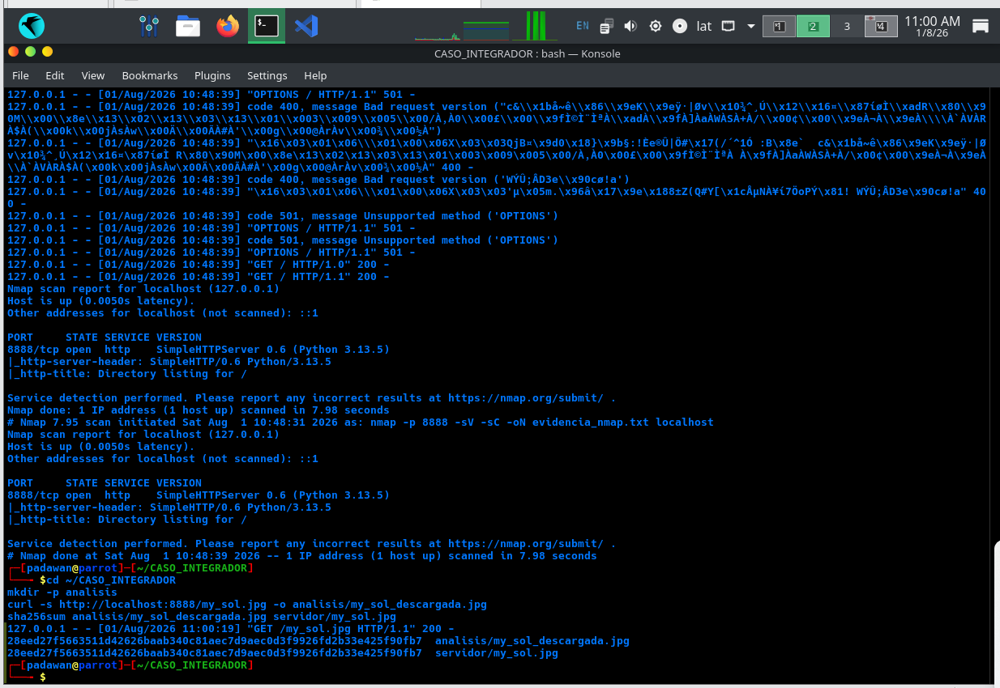
*Figura 6. Descarga del archivo sospechoso y verificación de integridad: los hashes SHA256 del archivo original y de la copia descargada coinciden exactamente.*

Se analizan los metadatos con ExifTool, sin encontrar ningún indicio del contenido oculto:

```bash
exiftool analisis/my_sol_descargada.jpg
```

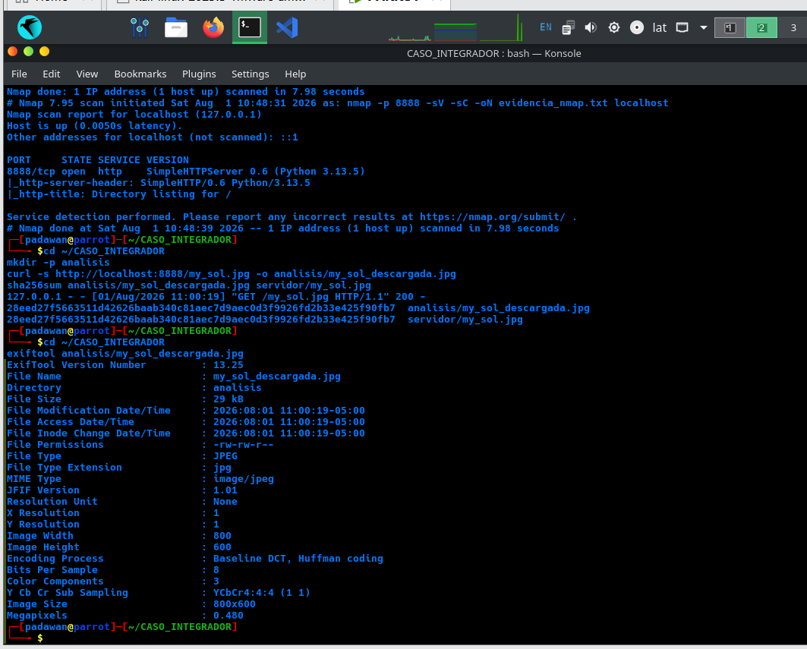
*Figura 7. Metadatos EXIF sin ningún campo sospechoso: la esteganografía no deja rastro detectable por un analizador de metadatos convencional.*

Se instala `stegseek` para intentar detectar y romper el ocultamiento por fuerza bruta de diccionario:

```bash
sudo apt install -y stegseek
stegseek analisis/my_sol_descargada.jpg
```

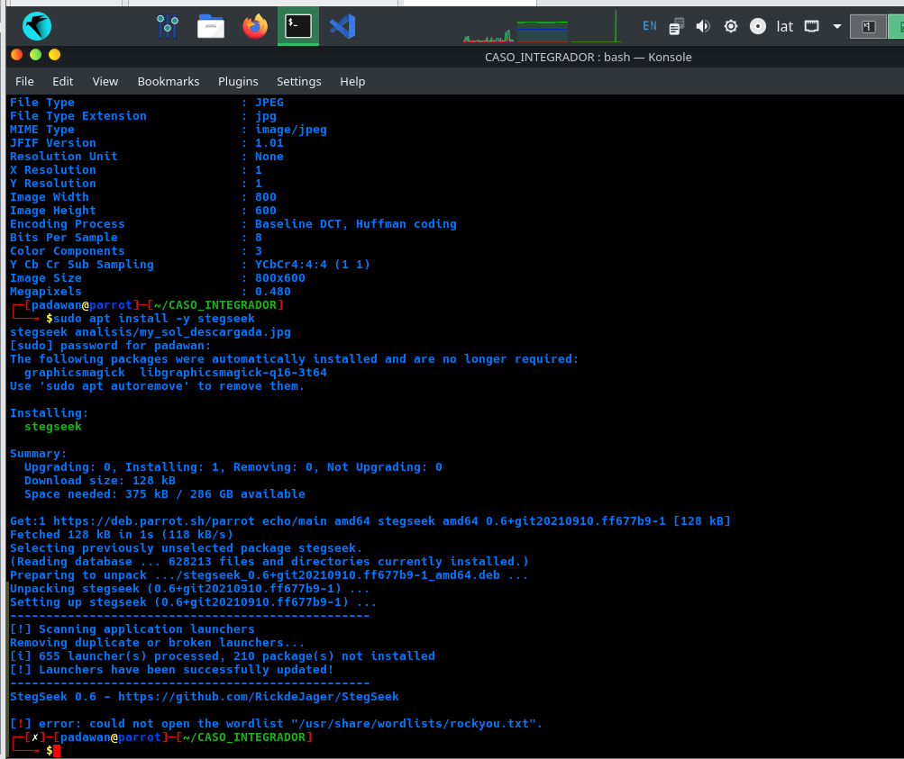
*Figura 8. Primer intento fallido: stegseek requiere por defecto la wordlist rockyou.txt, no disponible en la instalación base de Parrot OS. Se resolvió instalando el paquete `wordlists` y descomprimiendo el diccionario.*

```bash
sudo apt install -y wordlists
sudo gunzip /usr/share/wordlists/rockyou.txt.gz
stegseek analisis/my_sol_descargada.jpg
```

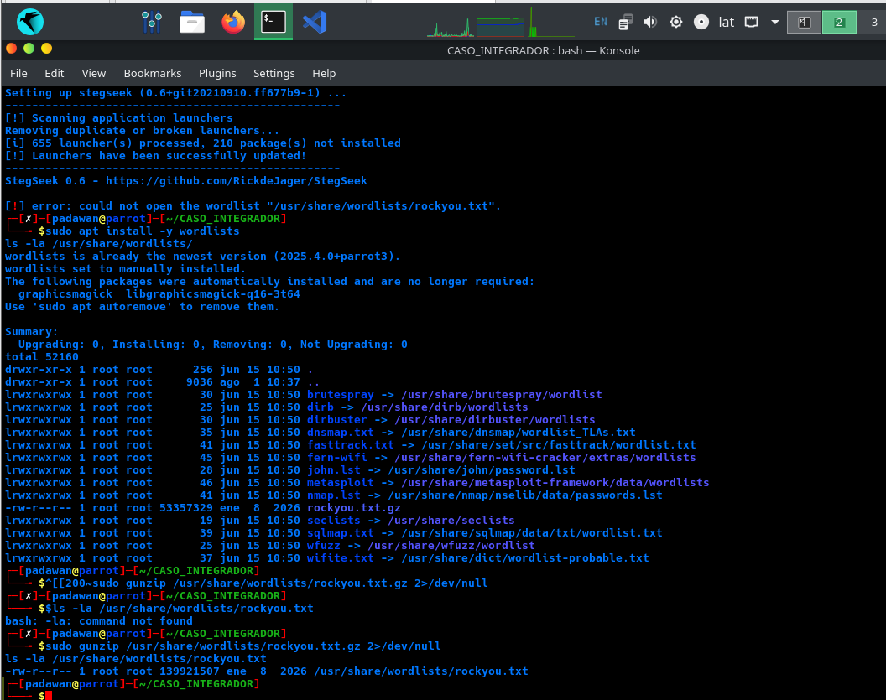
*Figura 9. stegseek rompe la contraseña de steghide (clave123) usando el diccionario rockyou.txt y extrae automáticamente el archivo oculto secreto.txt.*

Se verifica el contenido extraído y su integridad frente al archivo original:

```bash
cat my_sol_descargada.jpg.out
sha256sum my_sol_descargada.jpg.out secreto.txt
```

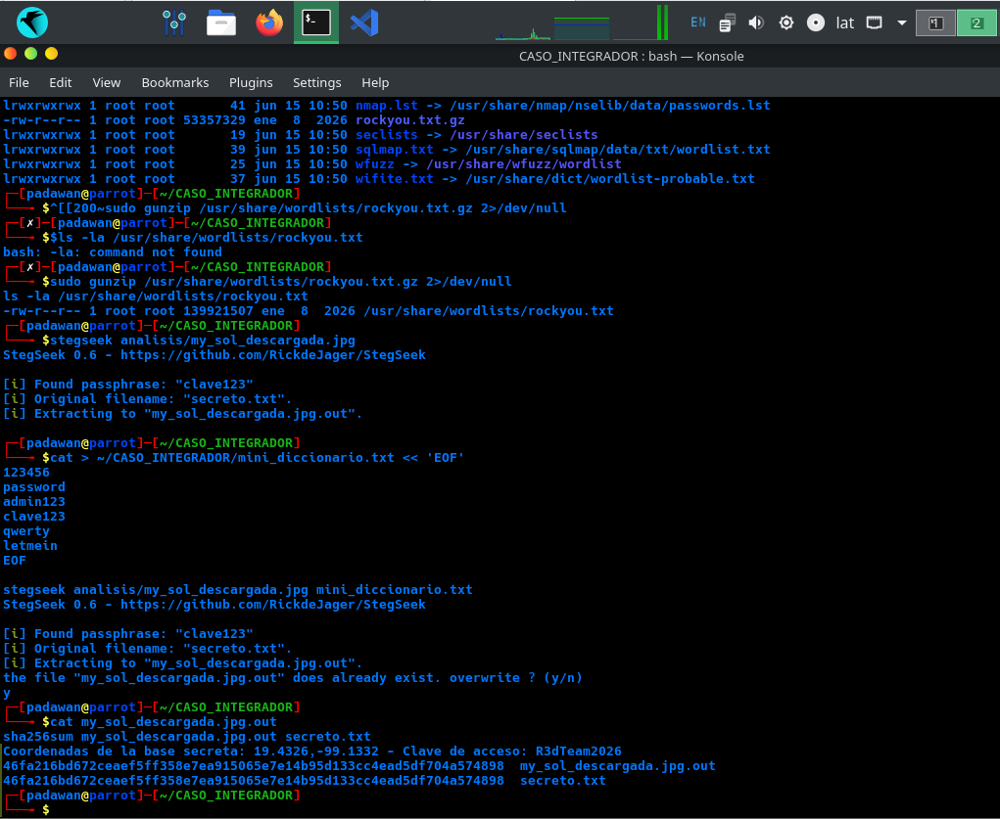
*Figura 10. El contenido extraído coincide exactamente con el mensaje original oculto, y los hashes SHA256 de ambos archivos son idénticos, confirmando la integridad de la extracción.*

### Fase 3 — Timeline forense del caso completo

Se cierra la investigación aplicando la misma metodología de timeline utilizada en la práctica forense anterior.

```bash
mkdir -p evidencia_final
{
  echo "=== RESUMEN DEL CASO ==="
  echo "Host analizado: localhost:8888"
  echo "Servicio: SimpleHTTPServer 0.6 (Python 3.13.5)"
  echo "Archivo sospechoso: my_sol.jpg"
  echo "Contenido oculto: secreto.txt (extraído exitosamente)"
  echo "Passphrase comprometida: clave123 (encontrada en rockyou.txt)"
  echo ""
  echo "=== TIMELINE DE ARCHIVOS DEL CASO ==="
  find ~/CASO_INTEGRADOR -type f -printf "%TY-%Tm-%Td %TH:%TM:%TS | %p\n" | sort
} > evidencia_final/00_Resumen_Timeline.txt

sha256sum servidor/my_sol.jpg analisis/my_sol_descargada.jpg my_sol_descargada.jpg.out \
  secreto.txt evidencia_nmap.txt > evidencia_final/HASHES_CASO_COMPLETO.txt
```

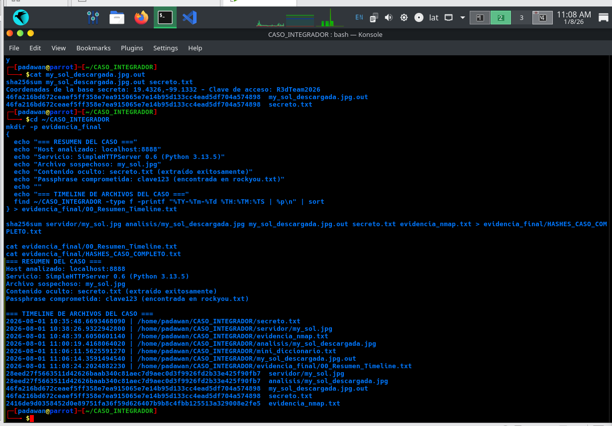
*Figura 11. Timeline final del caso: secuencia cronológica completa desde la creación del archivo oculto hasta el cierre de la investigación, junto con el hashing consolidado de toda la evidencia.*

## 4. Análisis de resultados

| Etapa | Hallazgo |
|---|---|
| Reconocimiento (Nmap) | Servicio identificado con versión exacta (SimpleHTTPServer 0.6, Python 3.13.5) y directory listing expuesto detectado automáticamente por scripts NSE. |
| Descarga y metadatos | Integridad confirmada por hash en la descarga; ExifTool no reveló ningún indicio del contenido oculto. |
| Esteganografía | stegseek rompió la contraseña débil (`clave123`) en segundos usando un diccionario de contraseñas filtradas (rockyou.txt) y extrajo el archivo oculto con integridad verificada. |
| Timeline | Secuencia de eventos reconstruida sin saltos ni inconsistencias, desde la creación de la evidencia hasta el cierre del caso. |

- El directory listing expuesto por el servidor permitió localizar el archivo sospechoso sin necesidad de fuerza bruta de rutas, evidenciando el riesgo de servir contenido con listados de directorio habilitados.
- La ausencia de metadatos sospechosos en ExifTool confirma que la esteganografía es una técnica de ocultamiento distinta y complementaria a la exposición de metadatos: requiere herramientas de detección específicas, no un análisis de metadatos convencional.
- El uso de una contraseña débil y común (`clave123`) para proteger el contenido oculto permitió que fuera comprometida en segundos mediante un ataque de diccionario con una wordlist de contraseñas filtradas públicamente disponible.
- La wordlist `rockyou.txt` no viene preinstalada por defecto en Parrot OS; fue necesario instalarla explícitamente mediante el paquete `wordlists`.

## 5. Conclusiones

El caso integrador permitió aplicar de forma encadenada tres disciplinas de seguridad ofensiva y defensiva: reconocimiento de red, esteganografía y análisis forense de timeline, demostrando cómo se combinan en una investigación real: un escaneo revela un servicio expuesto, el análisis del contenido descubre información oculta, y la documentación forense reconstruye la secuencia completa de eventos con evidencia verificable.

El hallazgo más relevante desde la perspectiva de seguridad defensiva es la fragilidad de proteger información sensible con contraseñas débiles: la misma facilidad con la que se ocultó el mensaje fue la misma con la que se recuperó, una vez aplicado un ataque de diccionario simple.

Desde la perspectiva metodológica, el caso reforzó la práctica de verificar la integridad de la evidencia en cada transición (descarga, extracción) mediante hashing, y de documentar tanto los hallazgos técnicos como las adaptaciones necesarias durante la investigación (como la instalación de la wordlist faltante).

---

> ⚠️ **Nota:** Todo el escenario (mensaje oculto, coordenadas, clave de acceso y servicio expuesto) fue creado deliberadamente con fines educativos dentro de un entorno propio y controlado (localhost). No representa un incidente de seguridad real ni fue ejecutado contra sistemas ajenos.
